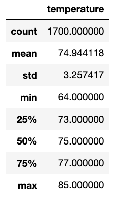
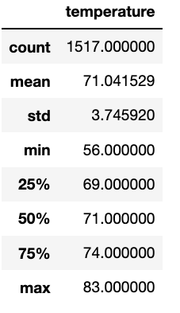
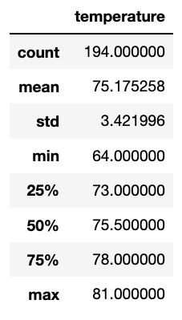
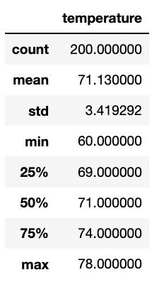
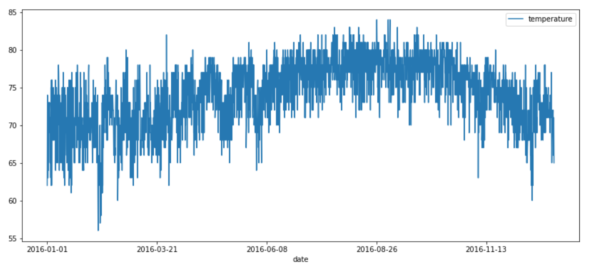
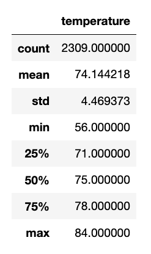

# Surf's Up

## Overview of Project

### Purpose

The purpose of this analysis was to practice using Python, Pandas functions and methods, and SQLAlchemy to analyze Oahu's temperature trends in order to determine if the surf and ice cream shop business is sustainable year-round.

## Results

Below is a summary of temperatures for June (left) and December (right).

  

Key differences:
- **mean**: The average temperature in the month of June was 74 degrees while the average temperature in December was 71.
- **min**: The lowest temperature in June was 64 degrees but 56 degrees in December.
- **max**: The highest temperature in June was 85 degrees while December's highest temperature was 83 degrees.

## Summary

While there are significant differences in the lowest temperatures for the month, there is only a three percent difference in the average temperatures for June and December.

### Additional queries

1. An additional query performed was to filter the June and December data sets to a single year. The most recent and complet data set was analyzed, which was the year 2016.

Below is a summary of temperatures for June (left) and December (right).

  

2. To gain a better understanding of the temperature year-round, a query was performed to compare the June and December temperatures to other months in the year. The most recent and complet data set was analyzed, which was the year 2016.

 

The graph and summary above shows that other than peak temperatures in August, temperatures range in the 70's year-round.